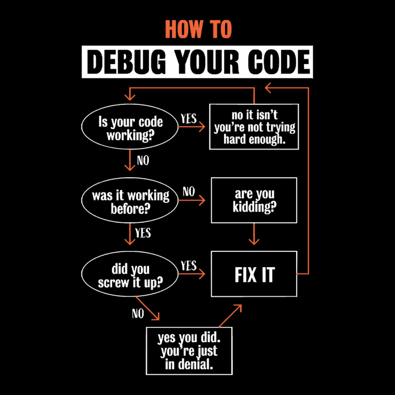
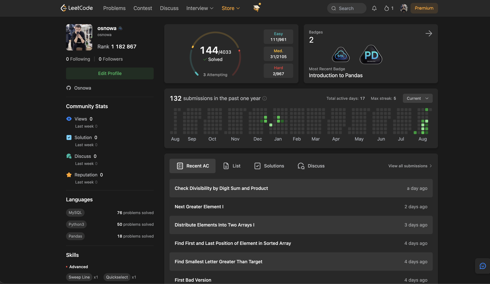

&nbsp;

## 🇷🇺 Илья Савин

**QA-инженер / backend-разработчик**

📍 Москва (Ростов-на-Дону) &nbsp;•&nbsp; ✉️ ilja.savin18@yandex.ru &nbsp;•&nbsp; 💬 Telegram: _@Osnowwa_

QA-инженер / backend-разработчик. Тестирую вручную и развиваю автоматизацию на pytest, параллельно пишу backend на FastAPI и Telegram-ботов, работаю с LLM и AI-агентами. Ранее занимался системным администрированием.

Дальнейший фокус — вырасти в **AQA-инженера** (full-stack тестировщика): совмещаю ручное тестирование с разработкой автотестов и pet-проектами.

---

### 🔭 Над чем я работаю

- 🤖 **AI/LLM pet-проект** — работа с промптами, **RAG**, векторные базы данных (Chroma, Qdrant), локальные модели (Ollama, Mistral AI), сборка AI-ассистентов
- 🧪 **Ручное тестирование сайтов** — UI, кросс-браузерные проверки, работа с DevTools
- ⚙️ **Автоматизация тестирования** — автотесты на pytest, разработка чек-листов и тестовой документации
- 🔁 **Backend pet-проекты** — прокачиваю стек FastAPI + PostgreSQL/MongoDB + Docker + CI/CD: от простого CRUD до JWT/RBAC и кэширования. + внедряю LLM и AI.
- 🐧 **Практика Linux-администрирования** — сеть и диагностика (`ping`, `curl`, `netstat`), права доступа, процессы, bash-скрипты

 

---

### 🧰 Стек и инструменты

**Тестирование / QA**

 &nbsp;
 &nbsp;
 &nbsp;
 &nbsp;

**Backend**

`Python 3.11+` · `ООП` · `FastAPI` · `SQLAlchemy (Async)` · `Alembic` · `Pydantic` · `JWT / RBAC` · `Aiogram 3` · `HTTPX` · `NumPy` · `Pandas`

**AI / LLM**

`RAG` · `Векторные базы данных` · `Prompt engineering`

**Базы данных**

**DevOps / Linux**

`systemd` · `cron` · `ufw` · `SSH` · `сети (OSI/TCP-IP, NAT, маршрутизация)` · `GitHub Actions CI/CD` · `VPS-деплой` · `Ruff`

**Инструменты разработки**

---

### 🧪 Тестовые проекты и артефакты

- [Мобильное тестирование](https://github.com/Osnowa/Mobile_Testing.git) – тест-кейсы, чек-лист и Jira-баг-репорты по мобильному таск-менеджеру
- [Веб-тестирование](https://github.com/Osnowa/Web_testing.git) – тестирование интернет-магазина demoshopping.ru: баг-репорты, чек-лист, анализ требований, тест-дизайн (эквивалентное разбиение, таблица принятия решений), тестовые данные
- [API-тестирование](https://github.com/Osnowa/API_Testing.git) – Postman-коллекции REST и SOAP, cURL-примеры
- [SQL](https://github.com/Osnowa/SQL.git) – практика SELECT и JOIN в MySQL
- [MongoDB](https://github.com/Osnowa/Mongo_DB.git) – практика NoSQL-запросов
- [Linux / Bash](https://github.com/Osnowa/Linux-Bash.git) – скрипты: файлы и права, процессы, сеть

---

### 🚀 Backend-проекты

#### 🌟 Основные проекты

| Проект                                                                      | Описание                                                                                                                                                        | Стек                                                                                                   |
| --------------------------------------------------------------------------- | --------------------------------------------------------------------------------------------------------------------------------------------------------------- | ------------------------------------------------------------------------------------------------------ |
| [Task Manager API + Telegram Bot](https://github.com/Osnowa/FastApi_TB.git) | «Задачник»: REST API (FastAPI) + Telegram-бот (Aiogram 3) — бот работает через ручки FastAPI: JWT-авторизация, Redis (токены + FSM), unit/integration-тесты, CI | `FastAPI` `SQLAlchemy` `Alembic` `JWT` `Redis` `Docker Compose` `pytest/httpx` `GitHub Actions` `Ruff` |
| [LLM_Notes](https://github.com/Osnowa/LLM_Notes.git)                        | Эксперименты с промптингом: два LLM-провайдера (локальный + облачный) через `ABC`, векторный поиск по смыслу в Chroma                                           | `Python (async)` `ChromaDB` `Ollama` `Mistral AI` `ABC` `RAG` `Docker`                                 |

#### 🔁 DNF — серия учебных проектов (прогресс от версии к версии)

| Версия                                                                           | Что добавлено                                                                   | Стек                                |
| -------------------------------------------------------------------------------- | ------------------------------------------------------------------------------- | ----------------------------------- |
| [Docker_Nginx_FastAPI](https://github.com/Osnowa/Docker_Ngnix_FastAPI.git)       | Базовый FastAPI + SQLite + Docker + Nginx (reverse proxy)                       | FastAPI, aiosqlite, Docker          |
| [Docker_Nginx_FastAPI_V2](https://github.com/Osnowa/Docker_Ngnix_FastAPI_V2.git) | + ORM, скрипт наполнения БД                                                     | + SQLAlchemy                        |
| [DNF_V3](https://github.com/Osnowa/DNF_V3.git)                                   | CRUD, роутеры/схемы/репозитории, интеграционные тесты                           | + PostgreSQL, Alembic, pytest/httpx |
| [DNF_V4](https://github.com/Osnowa/DNF_V4.git)                                   | Регистрация/логин, JWT, роли (RBAC), покрытие тестами 93%                       | + JWT auth                          |
| [DNF_V5](https://github.com/Osnowa/DNF_V5.git)                                   | Переход на MongoDB, полный CI/CD (GitHub Actions → GHCR → деплой на VPS по SSH) | + MongoDB, Beanie, Testcontainers   |
| [DNF_V6](https://github.com/Osnowa/DNF_V6.git)                                   | Redis-кэширование (Cache-Aside, TTL, инвалидация)                               | + Redis                             |

#### 🎮 Telegram-боты

| Проект                                                       | Описание                                                                                   | Стек                                                                      |
| ------------------------------------------------------------ | ------------------------------------------------------------------------------------------ | ------------------------------------------------------------------------- |
| [Bot_roll_dice](https://github.com/Osnowa/Bot_roll_dice.git) | Кости против бота, лидерборд, слоистая архитектура (Handlers → Services → Repository → DB) | Aiogram 3, PostgreSQL, SQLAlchemy Async, Redis, Docker, GitHub Actions CI |
| [Bot_QN](https://github.com/Osnowa/Bot_QN.git)               | «Угадай число» — FSM, игровые сессии                                                       | Aiogram 3, PostgreSQL, Redis, Docker                                      |
| [Bot_RP](https://github.com/Osnowa/Bot_RP.git)               | «Камень-ножницы-бумага» с суперсилой ONE PUNCH MAN, юнит-тесты                             | Aiogram 3, SQLite, pytest/mock                                            |

---

### 📈 Обучение и практика

**Stepik** — [профиль](https://stepik.org/users/588511871/profile) · 9 253 решённые задачи · 271 репутация · 9.2K знаний

Python · Асинхронное программирование · SQL · Тестирование ПО · Linux / Терминал · Docker · Git / GitHub · Веб-разработка (HTML/CSS) · Data Science (Pandas) · Go — первое знакомство

**LeetCode** — _[профиль](https://leetcode.com/u/osnowa/)_

---

### 💼 Опыт работы

**Ассистент курса на Stepik / pet-проекты** · 2023–2024
Помогал с ведением курса на Stepik, параллельно разрабатывал собственные учебные backend-проекты (серия DNF).

**ИП «ГИФ»** — backend-разработка / тестирование · 2021–2023
Backend-разработка и тестирование, параллельно — профильные курсы на Stepik.

**«Adoors»** (Москва) — системное администрирование · 2019–2021
Настройка и поддержка CRM-системы, базовое обслуживание рабочих станций. С 2020 года — участие в переводе инфраструктуры компании в онлайн: помощь с Linux-серверами (порты, контейнеры, логи, права доступа, мониторинг нагрузки).

**«Просто Двери»** (Москва) — ассистент ИП · 2018–2019
Коммуникация с клиентами.

Опыт 2019–2023 под наставничеством IT - специалиста.  Высшее техническое образование · 2018–2022.  Второе высшее + повышение квалификации «Автоматизация процессов с Python» · 2022–2024 

---

 

## 🇬🇧 Ilya Savin

**QA Engineer / Backend Developer**

📍 Moscow (Rostov-on-Don) &nbsp;•&nbsp; ✉️ ilja.savin18@yandex.ru &nbsp;•&nbsp; 💬 Telegram: _@Osnowwa_

QA Engineer / Backend Developer. I test manually and build automation with pytest, while also building backends with FastAPI, Telegram bots, and working with LLMs and AI agents. Previously worked in system administration.

Next focus — growing into an **AQA Engineer** (full-stack tester): combining manual testing with test automation and pet projects.

---

### 🔭 Currently working on

- 🤖 **AI/LLM pet project** — prompting, **RAG**, vector databases (Chroma, Qdrant), local models (Ollama, Mistral AI), building AI assistants
- 🧪 **Manual website testing** — UI, cross-browser checks, DevTools
- ⚙️ **Test automation** — automated tests with pytest, checklists, test documentation
- 🔁 **Backend pet projects** — building up the FastAPI + PostgreSQL/MongoDB + Docker + CI/CD stack: from basic CRUD to JWT/RBAC and caching, plus integrating LLMs and AI
- 🐧 **Linux administration practice** — networking and diagnostics (`ping`, `curl`, `netstat`), permissions, processes, bash scripting

 

---

### 🧰 Stack & Tools

**Testing / QA:** Postman, Jira, Figma, Chrome DevTools, Android Studio, Xcode, Test IT, TestRail, SoapUI, Bruno, Charles Proxy, Safari Web Inspector, pytest/mock/testcontainers

**Backend:** Python 3.11+, OOP, FastAPI, SQLAlchemy (Async), Alembic, Pydantic, JWT/RBAC, Aiogram 3, HTTPX, NumPy, Pandas

**AI / LLM:** Chroma, Qdrant, Mistral AI, Ollama — RAG, vector databases, prompt engineering

**Databases:** PostgreSQL, MySQL, MongoDB, Redis, SQLite

**DevOps / Linux:** Docker, Docker Compose, Nginx, systemd, cron, ufw, SSH, networking (OSI/TCP-IP, NAT, routing), GitHub Actions CI/CD, VPS deployment, Ruff

**Tools:** VS Code, PyCharm, Git/GitHub

---

### 🧪 Testing Projects & Artifacts

- [Mobile Testing](https://github.com/Osnowa/Mobile_Testing.git) – test cases, checklist, and Jira bug reports for the mobile task-manager app
- [Web Testing](https://github.com/Osnowa/Web_testing.git) – demoshopping.ru testing: bug reports, checklist, requirements analysis, test design, test data
- [API Testing](https://github.com/Osnowa/API_Testing.git) – Postman collections REST + SOAP, cURL examples
- [SQL](https://github.com/Osnowa/SQL.git) – MySQL SELECT & JOIN practice
- [MongoDB](https://github.com/Osnowa/Mongo_DB.git) – NoSQL query practice
- [Linux / Bash](https://github.com/Osnowa/Linux-Bash.git) – scripts: files/permissions, processes, networking

---

### 🚀 Backend Projects

#### 🌟 Main Projects

| Project                                                                     | Description                                                                                                                                                        | Stack                                                                                                  |
| --------------------------------------------------------------------------- | ------------------------------------------------------------------------------------------------------------------------------------------------------------------ | ------------------------------------------------------------------------------------------------------ |
| [Task Manager API + Telegram Bot](https://github.com/Osnowa/FastApi_TB.git) | "Task Tracker": REST API (FastAPI) + Telegram bot (Aiogram 3) — the bot talks to the FastAPI endpoints: JWT auth, Redis (tokens + FSM), unit/integration tests, CI | `FastAPI` `SQLAlchemy` `Alembic` `JWT` `Redis` `Docker Compose` `pytest/httpx` `GitHub Actions` `Ruff` |
| [LLM_Notes](https://github.com/Osnowa/LLM_Notes.git)                        | Prompting experiments: two LLM providers (local + cloud) behind `ABC`, vector (semantic) search in Chroma                                                          | `Python (async)` `ChromaDB` `Ollama` `Mistral AI` `ABC` `RAG` `Docker`                                 |

#### 🔁 DNF series — iterative learning project

| Version                                                                          | What's new                                                                  | Stack                               |
| -------------------------------------------------------------------------------- | --------------------------------------------------------------------------- | ----------------------------------- |
| [Docker_Nginx_FastAPI](https://github.com/Osnowa/Docker_Ngnix_FastAPI.git)       | Base FastAPI + SQLite + Docker + Nginx reverse proxy                        | FastAPI, aiosqlite, Docker          |
| [Docker_Nginx_FastAPI_V2](https://github.com/Osnowa/Docker_Ngnix_FastAPI_V2.git) | + ORM, seed script                                                          | + SQLAlchemy                        |
| [DNF_V3](https://github.com/Osnowa/DNF_V3.git)                                   | CRUD, routers/schemas/repositories, integration tests                       | + PostgreSQL, Alembic, pytest/httpx |
| [DNF_V4](https://github.com/Osnowa/DNF_V4.git)                                   | Registration/login, JWT, roles (RBAC), 93% test coverage                    | + JWT auth                          |
| [DNF_V5](https://github.com/Osnowa/DNF_V5.git)                                   | Switched to MongoDB, full CI/CD (GitHub Actions → GHCR → SSH deploy to VPS) | + MongoDB, Beanie, Testcontainers   |
| [DNF_V6](https://github.com/Osnowa/DNF_V6.git)                                   | Redis caching (Cache-Aside, TTL, invalidation)                              | + Redis                             |

#### 🎮 Telegram bots

| Project                                                      | Description                                                      | Stack                                                                     |
| ------------------------------------------------------------ | ---------------------------------------------------------------- | ------------------------------------------------------------------------- |
| [Bot_roll_dice](https://github.com/Osnowa/Bot_roll_dice.git) | Dice game vs bot, leaderboard, layered architecture              | Aiogram 3, PostgreSQL, SQLAlchemy Async, Redis, Docker, GitHub Actions CI |
| [Bot_QN](https://github.com/Osnowa/Bot_QN.git)               | Number-guessing game — FSM, game sessions                        | Aiogram 3, PostgreSQL, Redis, Docker                                      |
| [Bot_RP](https://github.com/Osnowa/Bot_RP.git)               | Rock-Paper-Scissors with a ONE PUNCH MAN superpower, unit-tested | Aiogram 3, SQLite, pytest/mock                                            |

---

### 📈 Learning & Practice

**Stepik** — [profile](https://stepik.org/users/588511871/profile) · 9,253 problems solved · 271 reputation · 9.2K knowledge points

Python · Async programming · SQL · Software Testing · Linux / Terminal · Docker · Git / GitHub · Web dev (HTML/CSS) · Data Science (Pandas) · Go — first steps

**LeetCode** — _[profile](https://leetcode.com/u/osnowa/)_

---

### 💼 Experience

**Stepik course assistant / pet projects** · 2023–2024
Assisted with running a course on Stepik, while building my own educational backend projects (the DNF series).

**IE "GIF"** — Backend Development / Testing · 2021–2023
Backend development and testing, alongside relevant Stepik courses.

**"Adoors"** (Moscow) — System Administration · 2019–2021
Set up and maintained a CRM system, basic workstation support. From 2020 — helped move the company's infrastructure online: Linux server support (ports, containers, logs, file permissions, load monitoring).

**"Prosto Dveri"** (Moscow) — Assistant to a sole proprietor · 2018–2019
Client communication.

### 🎓 Education

- Higher technical education · 2018–2022
- Second degree + professional development course "Process Automation with Python" · 2022–2024

2018–2023 experience was gained while studying at university, alongside coursework.

